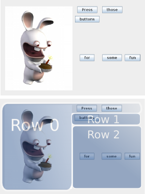

Grid Builder
===============

The grid builder is a special library of methods to easily organize components in row/columns,
whit automatic constraining.

# Entry point: the "grid" component

To use the grid builder, first mix in the GridBuilder trait :

    object App extends GridBuilder {
    
    }
    
Then, instanciate a grid by using the "grid" function, adding the result to a container:

    var panelObject = panel {
    
        p => 
        
            p <= grid {
            
                // Grid content goes here
            }
    }
    
    
# Grid Content: Rows and Colum

The grid structures the content in rows an columns.

The user must then explicitly specify the rows, and the list of components to be put in columns.
However, the exact positioning is handled by the api.

- Example1: A Row with one component

    
        grid {
            
            //-- Creating a row starts by naming it
            "rowName" row {
            
                //-- If only one component is provided, one column is created
                button("hello")
            }
        
            //-- This is the same, with less curly braces
            "rowName" row  button("hello")
    
        }
    
    
- Example 2: A Row with two components

        grid {
            
            "rowName" row {
            
                //-- The '|' operator separates the columns
                button("hello") | button("world")
            }
        
            //-- This is the same, with separate component creation, and structuring
            "rowName" row {
                
                var helloButton = button("hello")
                var worldButton = button("world")
                
                //-- The columns order must be the last thing in the row content
                helloButton | worldButton
                
            }
            
            //-- Here hello and world are inverted
            "rowName" row {
                
                var helloButton = button("hello")
                var worldButton = button("world")
                
                //-- The columns order must be the last thing in the row content
                worldButton | helloButton
                
            }
    
        }
    
 # Row Spanning
 
 Row Spanning helps structuring components when one of them should span in the height, along some other rows on the right for example.
 A Typical construct, shown in the following image, is when a picture, like a logo is placed left of some controls :
 
 

 
 
 To build this, the API offers an intuitive way, using the "spanRight" column building method instead of the "|" operator:
 
    grid {
    
        "main" row {
        
          cakeRabbit spanRight {
    
            "-" row {
            
              button("Press") | button("those")
              
            }
            
            "-" row {
            
              button("buttons")
    
            }
            "-" row {
              button("for") | button("some") | button("fun")
    
            }
    
          }
        }   
    } 
 
 
 
 
 